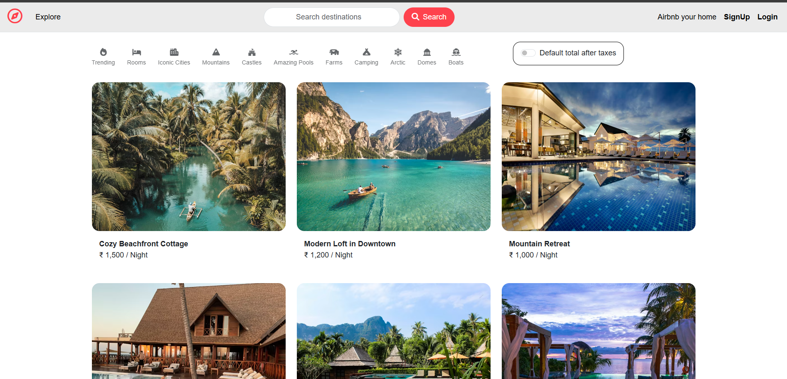
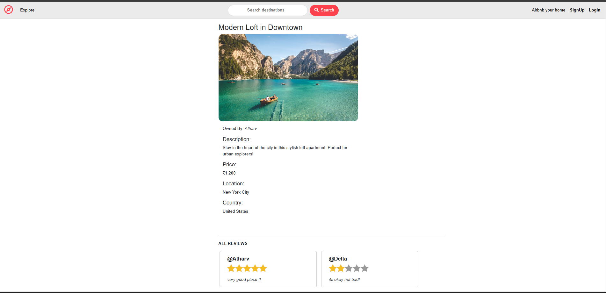
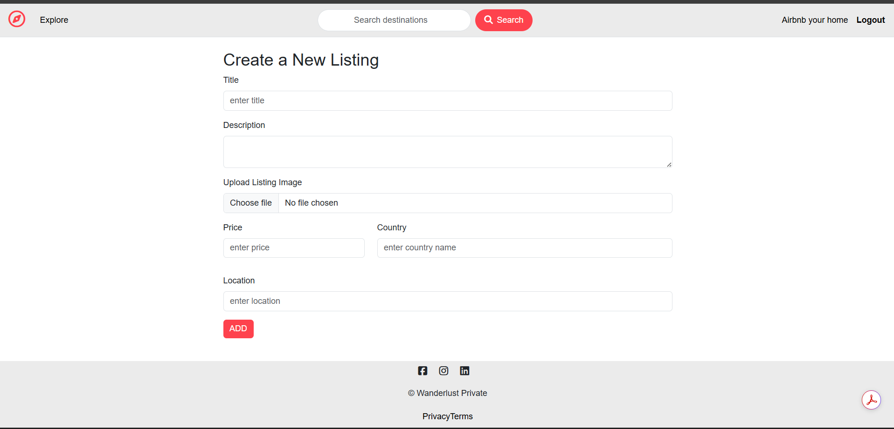
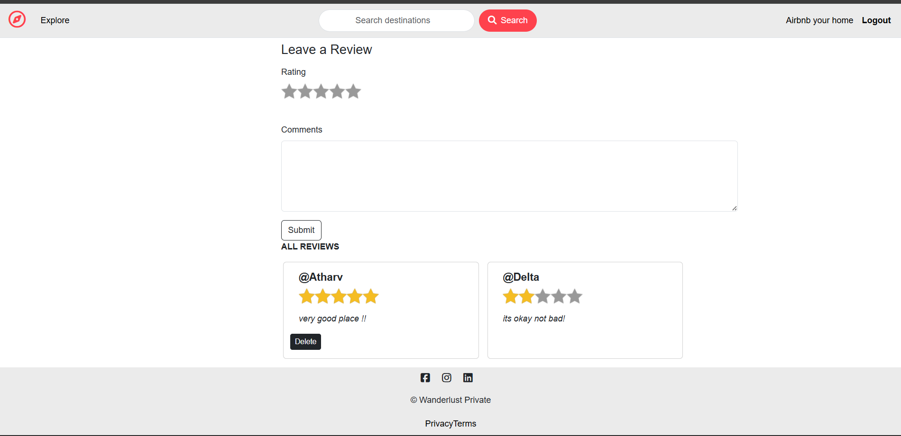
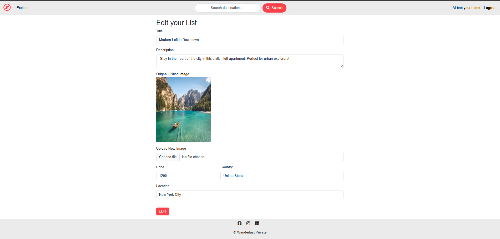

# 🌍 Wanderlust

**A full-stack Airbnb-inspired web app for discovering, listing, and reviewing travel destinations.**


---

Users can browse listings, search by title/location/price, sign up, create their own listings with image uploads, leave star-rated reviews, and manage their content — with full authentication, authorization, and server-side validation.

Built as a portfolio project demonstrating **MVC architecture, RESTful routing, Passport authentication, Mongoose relationships, Cloudinary integration, and session-based auth with MongoStore**.

---

## 🛠️ Tech Stack

| Layer | Technology |
|---|---|
| **Runtime** | Node.js 22 |
| **Framework** | Express.js 5 |
| **Database** | MongoDB Atlas + Mongoose 9 |
| **Templating** | EJS + ejs-mate (layouts & partials) |
| **Auth** | Passport.js (local strategy) + passport-local-mongoose |
| **Sessions** | express-session + connect-mongo (MongoStore) |
| **Image Upload** | Multer → multer-storage-cloudinary → Cloudinary |
| **Validation** | Joi (server-side schema validation) |
| **UI** | Bootstrap 5.3, Font Awesome 7, Plus Jakarta Sans, Starability CSS |
| **Utilities** | method-override, connect-flash, dotenv |

---

## ✨ Key Features

- **Full CRUD** — Create, read, update, and delete listings with image upload
- **Search** — Case-insensitive title/location search and exact price search via `GET /listings?search=`
- **Star Reviews** — 1–5 star ratings with comments; review author attribution
- **Authentication** — Signup/login/logout with Passport.js; sessions persisted in MongoDB
- **Authorization** — Owner-only listing edit/delete; author-only review delete
- **Image Pipeline** — File upload via Multer streaming to Cloudinary; URL stored in MongoDB
- **Validation** — Joi schemas validate all listing and review submissions server-side
- **Error Handling** — Custom `ExpressError` class + `wrapAsync` utility for clean async error propagation
- **Flash Messages** — Success/error notifications via connect-flash
- **Responsive UI** — Bootstrap 5 grid with EJS layouts, partials, and Starability star ratings
- **Cascade Deletes** — Deleting a listing automatically removes all its reviews (Mongoose post hook)
- **Tax Toggle** — Show/hide +18% GST info on listing cards

---

## 🏗️ How It Works

```
Browser → Express Router → Middleware (auth/validation/upload) → Controller → Mongoose → MongoDB
                                                                     ↓
                                                              EJS View (boilerplate layout + partials)
                                                                     ↓
                                                                  Browser
```

**Key patterns:**
- **MVC** — Models (`models/`), Views (`views/`), Controllers (`controllers/`), Routes (`routes/`)
- **RESTful routes** — 12 routes across listings, reviews, and users; `method-override` for PUT/DELETE from forms
- **Deep population** — `Listing.findById(id).populate({ path: "reviews", populate: { path: "author" } }).populate("owner")`
- **Middleware chain** — `isLoggedIn` → `isOwner` / `isReviewAuthor` → `validateListing` / `validateReview` → controller

---

## 📸 Screenshots

### 🏠 Landing Page


### 🏨 Listings


### 🔐 Login


### ⭐ Reviews


### ✏️ Edit Listing



## 🔎 Search

| Input | Behavior |
|---|---|
| `beach` | Case-insensitive regex match on `title` and `location` |
| `BEACH` | Same — `$options: "i"` |
| `5000` | Exact price match (`{ price: 5000 }`) |
| *(empty)* | Returns all listings |
| *(no match)* | Friendly "No listings found" message with link back |

Search query appears in the URL (`/listings?search=beach`) and pre-fills the search bar.

---

## 🔐 Auth & Authorization

- **Passport.js** local strategy with `passport-local-mongoose` (PBKDF2 hash + salt)
- **Sessions** stored in MongoDB via `connect-mongo` — survive server restarts
- **Post-login redirect** — `saveRedirectUrl` middleware remembers the intended URL
- **`isLoggedIn`** — blocks unauthenticated access to create/edit/delete/review routes
- **`isOwner`** — compares `listing.owner` ObjectId with `currUser._id`
- **`isReviewAuthor`** — compares `review.author` ObjectId with `currUser._id`

---

## ☁️ Image Upload

Listings use **Multer** to stream uploads directly to **Cloudinary** (`wanderlust_DEV/` folder, png/jpg/jpeg). The returned URL and filename are stored on the Listing document. On edit, a new upload replaces the old image; no upload keeps the existing one.

---

## ⚙️ Local Setup

```bash
git clone <your-repo-url>
cd Wanderlust_project
npm install
```

Create a `.env` file:

```env
ATLAS_DB_URL=your_mongodb_atlas_connection_string
SECRET=your_session_secret
CLOUD_NAME=your_cloudinary_cloud_name
CLOUD_API_KEY=your_cloudinary_api_key
CLOUD_API_SECRET=your_cloudinary_api_secret
```

Optionally seed the database:

```bash
node init/index.js
```

Start the server:

```bash
nodemon app.js
```

Open **http://localhost:8080**

---

## 🌐 Live Demo

> Add your deployed URL here once available:
> ```
> https://wanderlust-project-t3z7.onrender.com/listings
> ```

---

## 🚀 Future Improvements

- Pagination for listing index
- Price range slider / advanced filters
- Map integration (Mapbox / Google Maps)
- Booking & availability system
- Cloudinary image transformations for responsive images
- Automated tests (Jest / Supertest)
- Rate limiting on login
- Make category filter icons functional

---

## 👨‍💻 Author

**Atharv Harde** — [GitHub](https://github.com/Atharvharde01)
